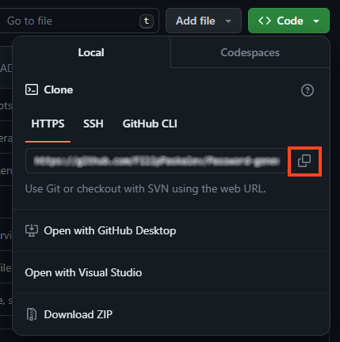

# InstaGit by Reactless Team

    [](./LICENSE)


## Description

Instagram for GitHub users to share profiles access repos and sign up.

## Table of Contents
- [InstaGit by Reactless Team](#instagit-by-reactless-team)
  - [Description](#description)
  - [Table of Contents](#table-of-contents)
  - [Website Preview](#website-preview)
  - [Features](#features)
  - [Installation](#installation)
    - [Option 1 - Download](#option-1---download)
    - [Option 2 - Clone project](#option-2---clone-project)
  - [Usage](#usage)
    - [Start the application](#start-the-application)
  - [Technologies](#technologies)
  - [Tools and extensions](#tools-and-extensions)
    - [Visual Studio Code](#visual-studio-code)
    - [VS Code Counter](#vs-code-counter)
    - [JSDoc 4.0.2](#jsdoc-402)
    - [Prettier 3.2.5](#prettier-325)
  - [Project Requirements](#project-requirements)
  - [Statistics](#statistics)
    - [Languages](#languages)
    - [Directories](#directories)
  - [Contributing](#contributing)
  - [License](#license)
  - [Contact](#contact)
  
## Website Preview

Here's a look at the InstaGit web application.


Home page:
- with Anime.js library in banner area;
- with fetch the GitHub API in Cards for showing REPO and user info

Contact page:

- with the subscription form and store in local server;

## Features
- Easy to search and share the GitHub repositories
- Fetch the GitHub API for showing the REPO

- Simple and works in your browser.
- Your data stays on your device, ensuring your privacy and security.

## Installation

### Option 1 - Download

Download the project from GitHub [repository](https://github.com/DonielM/team-reactless-instagit.git) on your local machine.

1. Open GitHub repository. [(link to repository)](https://github.com/DonielM/team-reactless-instagit.git)

2. Select ```Code``` from top navigation section. (reference on the image below) 👇

    

3. Select ```<> Code``` dropdown button from sub section. (reference on the image below) 👇

    

4. Select ```Download ZIP``` from dropdown menu to download project in .zip format. (reference on the image below) 👇

    

5.  Unzip the project. 

    > [!TIP]
    > You can use 7-Zip if you don't have file archiver. 
    >**7-Zip** is **free software** with **open source**. The most of the code is under the **GNU LGPL** license. Some parts of the code are under the BSD 3-clause License. Also there is unRAR license restriction for some parts of the code. Read [7-Zip License](https://www.7-zip.org/license.txt) information. 
    > Download the application from [official website](https://www.7-zip.org/).

6.  Open project with VS Code or other IDE.

### Option 2 - Clone project

1. On GitHub.com, navigate to the main page of the repository. [(link to repository)](https://github.com/DonielM/team-reactless-instagit.git).

2. Above the list of files, click  Code. (reference on the image below) 👇

    

3. Copy the URL for the repository.
- To clone the repository using HTTPS, under "HTTPS", click <svg version="1.1" fill="#0F66B8" width="16" height="16" viewBox="0 0 16 16" aria-label="Copy to clipboard" role="img"><path d="M3.626 3.533a.249.249 0 0 0-.126.217v9.5c0 .138.112.25.25.25h8.5a.25.25 0 0 0 .25-.25v-9.5a.249.249 0 0 0-.126-.217.75.75 0 0 1 .752-1.298c.541.313.874.89.874 1.515v9.5A1.75 1.75 0 0 1 12.25 15h-8.5A1.75 1.75 0 0 1 2 13.25v-9.5c0-.625.333-1.202.874-1.515a.75.75 0 0 1 .752 1.298ZM5.75 1h4.5a.75.75 0 0 1 .75.75v3a.75.75 0 0 1-.75.75h-4.5A.75.75 0 0 1 5 4.75v-3A.75.75 0 0 1 5.75 1Zm.75 3h3V2.5h-3Z"></path></svg>
- To clone the repository using an SSH key, including a certificate issued by your organization's SSH certificate authority, click SSH, then click <svg version="1.1" fill="#0F66B8" width="16" height="16" viewBox="0 0 16 16" aria-label="Copy to clipboard" role="img"><path d="M3.626 3.533a.249.249 0 0 0-.126.217v9.5c0 .138.112.25.25.25h8.5a.25.25 0 0 0 .25-.25v-9.5a.249.249 0 0 0-.126-.217.75.75 0 0 1 .752-1.298c.541.313.874.89.874 1.515v9.5A1.75 1.75 0 0 1 12.25 15h-8.5A1.75 1.75 0 0 1 2 13.25v-9.5c0-.625.333-1.202.874-1.515a.75.75 0 0 1 .752 1.298ZM5.75 1h4.5a.75.75 0 0 1 .75.75v3a.75.75 0 0 1-.75.75h-4.5A.75.75 0 0 1 5 4.75v-3A.75.75 0 0 1 5.75 1Zm.75 3h3V2.5h-3Z"></path></svg>
- To clone a repository using GitHub CLI, click GitHub CLI, then click <svg version="1.1" fill="#0F66B8" width="16" height="16" viewBox="0 0 16 16" aria-label="Copy to clipboard" role="img"><path d="M0 6.75C0 5.784.784 5 1.75 5h1.5a.75.75 0 0 1 0 1.5h-1.5a.25.25 0 0 0-.25.25v7.5c0 .138.112.25.25.25h7.5a.25.25 0 0 0 .25-.25v-1.5a.75.75 0 0 1 1.5 0v1.5A1.75 1.75 0 0 1 9.25 16h-7.5A1.75 1.75 0 0 1 0 14.25Z"></path><path d="M5 1.75C5 .784 5.784 0 6.75 0h7.5C15.216 0 16 .784 16 1.75v7.5A1.75 1.75 0 0 1 14.25 11h-7.5A1.75 1.75 0 0 1 5 9.25Zm1.75-.25a.25.25 0 0 0-.25.25v7.5c0 .138.112.25.25.25h7.5a.25.25 0 0 0 .25-.25v-7.5a.25.25 0 0 0-.25-.25Z"></path></svg> (reference on the image below) 👇

    

1. Open Git Bash.

2. Change the current working directory to the location where you want the cloned directory.

3. Type ```git clone```, and then paste the URL you copied earlier.

    ```
    git clone https://github.com/DonielM/team-reactless-instagit.git
    ```

4. Press Enter to create your local clone.

    ```
    $ git clone https://github.com/DonielM/team-reactless-instagit.git
    > Cloning into `Spoon-Knife`...
    > remote: Counting objects: 10, done.
    > remote: Compressing objects: 100% (8/8), done.
    > remove: Total 10 (delta 1), reused 10 (delta 1)
    > Unpacking objects: 100% (10/10), done.
    ```
## Usage

### Start the application

To start the application, run the following command in your terminal:

```bash
npm start
```

## Technologies

- [Node.js *v21.6.1*](https://nodejs.org/en)
- [HTML](https://html.com/)
- [Bootstrap](https://getbootstrap.com/)
- [CSS](https://www.w3.org/Style/CSS/Overview.en.html)
- [JavaScript](https://www.javascript.com/)
- [Prettier *v3.2.5*](https://prettier.io/)
- [Git](https://git-scm.com/)
- [JSDoc *v4.0.2*](https://jsdoc.app/)
- [React JS](https://reactjs.org/)
- [Anima.js](https://animaapp.com/)

## Tools and extensions

### Visual Studio Code

[Visual Studio Code](https://code.visualstudio.com/) is a lightweight but powerful source code editor which runs on your desktop and is available for Windows, macOS and Linux. It comes with built-in support for JavaScript, TypeScript and Node.js and has a rich ecosystem of extensions for other languages and runtime (such as C++, C#, Java, Python, PHP, Go, .NET).

### VS Code Counter

[VS Code extension](https://marketplace.visualstudio.com/items?itemName=uctakeoff.vscode-counter) counts blank lines, comment lines, and physical lines of source code in many programming languages. This extension uses other language extensions to determine the line of code. Therefore, you may need to install the language extension to support a new language. Conversely, as the number of language extensions increases, the range of support for this feature also increases.

### JSDoc 4.0.2

[JSDoc 3](https://jsdoc.app/about-getting-started) is an API documentation generator for JavaScript, similar to Javadoc. You add documentation comments directly to your source code, right alongside the code itself. The JSDoc tool will scan your source code and generate an HTML documentation website for you.

JSDoc's purpose is to document the API of your JavaScript application or library. It is assumed that you will want to document things like modules, namespaces, classes, methods, method parameters, and so on.

### Prettier 3.2.5

Prettier is an opinionated code formatter with support for:

- JavaScript (including experimental features)
- JSX
- Angular
- Vue
- Flow
- TypeScript
- CSS, Less, and SCSS
- HTML
- Ember/Handlebars
- JSON
- GraphQL
- Markdown, including GFM and MDX v1
- YAML

It removes all original styling* and ensures that all outputted code conforms to a consistent style. (See this [blog post](https://archive.jlongster.com/A-Prettier-Formatter))

Prettier takes your code and reprints it from scratch by taking the line length into account.

## Project Requirements

To ensure a dynamic and responsive user experience:

- Bootstrap for responsive design and components.
- fetch for dynamic content loading and API interactions.
- GitHub API for searching and showing the user info and Git repositories.
- Using ReactJs - like useState, useEffect, props etc...
- deployed in Netlify
- Mobile responsiveness to ensure accessibility on all devices.

## Statistics

### Languages
| language | files | code | comment | blank | total |
| :--- | ---: | ---: | ---: | ---: | ---: |
| JSON | 3 | 7,507 | 0 | 3 | 7,510 |
| JavaScript JSX | 14 | 755 | 23 | 90 | 868 |
| CSS | 13 | 513 | 6 | 102 | 621 |
| Markdown | 1 | 101 | 0 | 53 | 154 |
| JavaScript | 2 | 26 | 1 | 3 | 30 |
| HTML | 1 | 14 | 1 | 3 | 18 |
| SVG | 2 | 2 | 0 | 0 | 2 |

### Directories
| path | files | code | comment | blank | total |
| :--- | ---: | ---: | ---: | ---: | ---: |
| . | 36 | 8,918 | 31 | 254 | 9,203 |
| . (Files) | 6 | 7,476 | 2 | 61 | 7,539 |
| public | 1 | 1 | 0 | 0 | 1 |
| src | 29 | 1,441 | 29 | 193 | 1,663 |
| src (Files) | 2 | 29 | 0 | 5 | 34 |
| src\\assets | 1 | 1 | 0 | 0 | 1 |
| src\\components | 17 | 921 | 19 | 131 | 1,071 |
| src\\components\\contactForm | 2 | 148 | 0 | 25 | 173 |
| src\\components\\footer | 2 | 93 | 0 | 15 | 108 |
| src\\components\\gitHubCard | 1 | 19 | 0 | 5 | 24 |
| src\\components\\header | 2 | 90 | 0 | 15 | 105 |
| src\\components\\post | 2 | 89 | 4 | 15 | 108 |
| src\\components\\searchBtn | 2 | 117 | 3 | 19 | 139 |
| src\\components\\sideNav | 2 | 110 | 0 | 12 | 122 |
| src\\components\\timeline | 2 | 78 | 4 | 9 | 91 |
| src\\components\\userCard | 2 | 177 | 8 | 16 | 201 |
| src\\data | 1 | 172 | 0 | 1 | 173 |
| src\\pages | 6 | 233 | 10 | 37 | 280 |
| src\\pages\\contact | 2 | 42 | 0 | 7 | 49 |
| src\\pages\\home | 2 | 159 | 6 | 24 | 189 |
| src\\pages\\homePage | 2 | 32 | 4 | 6 | 42 |
| src\\styles | 2 | 85 | 0 | 19 | 104 |

## Contributing

If you'd like to contribute to this project, please follow the guidelines outlined in the CONTRIBUTING.md file.

## License

Copyright (c) 2024 DonielM

Permission is hereby granted, free of charge, to any person obtaining a copy of this software and associated documentation files (the "Software"), to deal in the Software without restriction, including without limitation the rights to use, copy, modify, merge, publish, distribute, sublicense, and/or sell copies of the Software, and to permit persons to whom the Software is furnished to do so, subject to the following conditions:

The above copyright notice and this permission notice shall be included in all copies or substantial portions of the Software.

THE SOFTWARE IS PROVIDED "AS IS", WITHOUT WARRANTY OF ANY KIND, EXPRESS OR IMPLIED, INCLUDING BUT NOT LIMITED TO THE WARRANTIES OF MERCHANTABILITY, FITNESS FOR A PARTICULAR PURPOSE AND NONINFRINGEMENT. IN NO EVENT SHALL THE AUTHORS OR COPYRIGHT HOLDERS BE LIABLE FOR ANY CLAIM, DAMAGES OR OTHER LIABILITY, WHETHER IN AN ACTION OF CONTRACT, TORT OR OTHERWISE, ARISING FROM, OUT OF OR IN CONNECTION WITH THE SOFTWARE OR THE USE OR OTHER DEALINGS IN THE SOFTWARE.

## Contact

Reactless Team

- [Project Link](https://instagit.netlify.app/)
- [Presentation](https://docs.google.com/presentation/d/1VIydn6ju9q68eONDgctykT-e8ekHA6nA/edit?usp=drive_link&ouid=111901218944162350914&rtpof=true&sd=true)